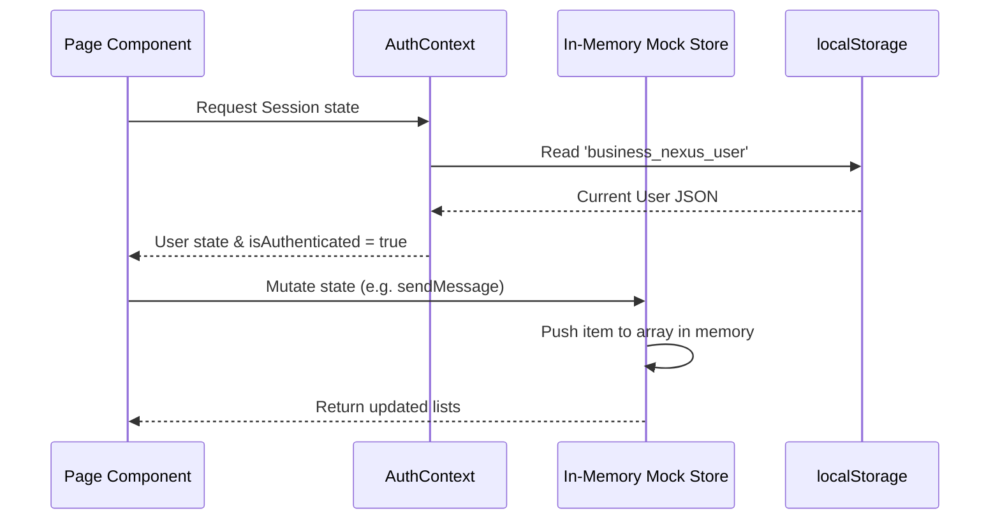

# Business Nexus - Codebase Architecture & Structure Guide

This document describes the application layout, component architecture, state management, and design conventions of the **Business Nexus** platform.

---

## 1. Directory Structure

The codebase is structured under `src/` as a modular React single-page application (SPA):

```
Nexus/
├── public/                 # Static assets (logos, icons)
├── src/
│   ├── components/         # Reusable React components
│   │   ├── chat/           # Chat-specific subcomponents
│   │   ├── collaboration/  # Collaboration cards & buttons
│   │   ├── entrepreneur/   # Entrepreneur UI blocks
│   │   ├── investor/       # Investor UI blocks
│   │   ├── layout/         # Shell framing (Navbar, Sidebar)
│   │   └── ui/             # Core design system atomic elements
│   ├── context/            # React context providers (AuthContext)
│   ├── data/               # Local mock databases & helper queries
│   ├── pages/              # Page view layers mapped to router paths
│   │   ├── auth/           # Login, Register, Recovery pages
│   │   ├── chat/           # Direct messaging screen
│   │   ├── dashboard/      # Entrepreneur & Investor custom dashboards
│   │   ├── deals/          # Investment pipelines tracker
│   │   ├── documents/      # Startup file storage and sharing
│   │   ├── entrepreneurs/  # Marketplace listing of startups
│   │   ├── help/           # support FAQ and helpdesk
│   │   ├── investors/      # Marketplace listing of investors
│   │   ├── messages/       # Inbox view
│   │   ├── notifications/  # Feed for connection notifications
│   │   ├── profile/        # Details for individual portfolios & pitch pages
│   │   └── settings/       # Account configuration forms
│   ├── types/              # Type definitions and interfaces
│   ├── App.tsx             # Main routing registry
│   ├── index.css           # CSS entry-point & Tailwind declarations
│   └── main.tsx            # React DOM mounting bootstrap
```

---

## 2. Component Architecture

The component hierarchy is structured in an atomic hierarchy:

### A. Atomic UI Controls (`src/components/ui/`)
Highly reusable, stateless styled components that receive properties and act as the baseline layout blocks:
*   [Avatar.tsx](file:///d:/Internship%20Projects/Nexus/src/components/ui/Avatar.tsx): Renders round user avatars with initials fallback logic and active indicators.
*   [Badge.tsx](file:///d:/Internship%20Projects/Nexus/src/components/ui/Badge.tsx): Colored label tags for status states (e.g. accepted, pending, declined, grey metadata).
*   [Button.tsx](file:///d:/Internship%20Projects/Nexus/src/components/ui/Button.tsx): Unified button component mapping variants (primary, secondary, success, outline) and states (loading, disabled).
*   [Card.tsx](file:///d:/Internship%20Projects/Nexus/src/components/ui/Card.tsx): Framing components containing CardHeader, CardBody, and CardFooter wrappers.
*   [Input.tsx](file:///d:/Internship%20Projects/Nexus/src/components/ui/Input.tsx): Wrapper for text fields offering label, helper text, and start/end icon adornments.

### B. Specialized Layout Framework (`src/components/layout/`)
Manages screen framing and conditional controls depending on the authenticated session:
*   [DashboardLayout.tsx](file:///d:/Internship%20Projects/Nexus/src/components/layout/DashboardLayout.tsx): Layout wrapper that mounts the common Navbar, Sidebar, and wraps page elements under route guards.
*   [Navbar.tsx](file:///d:/Internship%20Projects/Nexus/src/components/layout/Navbar.tsx): Header navigation bar containing role-based menu options and session actions.
*   [Sidebar.tsx](file:///d:/Internship%20Projects/Nexus/src/components/layout/Sidebar.tsx): Collapsible vertical navigation bar. Highlights active route states, shifting items depending on if the role is set to `entrepreneur` or `investor`.

### C. Domain Components
*   **Chat** (`src/components/chat/`): Focuses on ChatMessage items and ChatUserList sidebars.
*   **Collaboration** (`src/components/collaboration/`): Renders Connection request cards detailing status controls (Accept/Decline).
*   **Entities** (`src/components/entrepreneur/`, `src/components/investor/`): Specialized display components (like EntrepreneurCard & InvestorCard) used to show summaries in lists.

---

## 3. Routing & Page Architecture

Routes are managed inside `src/App.tsx` utilizing React Router v6.
Authentication status checks are enforced via `DashboardLayout`. Here is the main route registry layout:

*   `/login` | `/register` | `/forgot-password` -> Anonymous Auth Pages.
*   `/dashboard/entrepreneur` -> Home center for Entrepreneurs. Displays pending connection requests and recommended investors.
*   `/dashboard/investor` -> Discovery dashboard for Investors. Features query search bars and industry filter feeds.
*   `/profile/entrepreneur/:id` -> Detailed startup page showing team metrics, funding amount targets, and pitch texts.
*   `/profile/investor/:id` -> Portfolio description, minimum/maximum investment limits, and focus sectors.
*   `/chat` | `/chat/:userId` -> Messaging page between matched users.
*   `/deals` -> Pipeline management for tracking deal progression (Due Diligence, Term Sheet, Negotiation).
*   `/documents` -> File browser listing pitch decks and spreadsheets.

---

## 4. State Management & Data Flow



*   **Global User Session**: AuthContext manages registration, login tokens, credentials validation, and profile revisions. Session persistent caching is achieved via `localStorage` keys (`business_nexus_user`).
*   **Simulated API Latency**: API transactions are simulated locally using `setTimeout` to mimic network activity and loading screen states.
*   **In-Memory Variables**: Workspace structures (such as connection requests or message channels) are loaded in memory from `src/data/` files. Note that reloading the page resets mutations back to default mocks.

---

## 5. UI Theme & Spacing Principles

The platform follows a strict theme system using TailwindCSS utility classes:

### Grid & Layout Columns
Grid views are organized responsively based on standard screen breakpoints:
*   **Mobile Screens**: Single column flexbox (`grid-cols-1`).
*   **Medium Screens (Tablets)**: Double column layout (`md:grid-cols-2`).
*   **Large Screens (Desktop)**: 3 or 4 columns (`lg:grid-cols-3` / `lg:grid-cols-4`) with a centered max-width viewport container (`max-w-7xl mx-auto`).

### Typography Hierarchy
*   **Page Headings**: `font-bold text-2xl` (`h1` equivalent) or `text-lg font-medium` (`h2` equivalent) for sections.
*   **Text Weights**: Standard UI uses Inter typeface. Clear font-weights are maintained (e.g., `font-semibold` for headers, `font-medium` for subtexts, and `font-normal text-gray-500` for descriptions).
